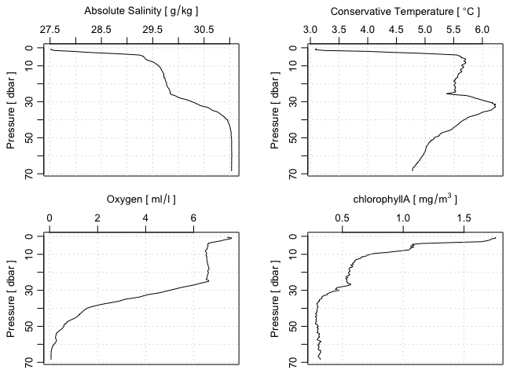

<!-- README.md is generated from README.Rmd. Please edit that file -->

# dod

<!-- badges: start -->

[](https://CRAN.R-project.org/package=dod)
[](https://github.com/dankelley/dod/actions/workflows/R-CMD-check.yaml)
<!-- badges: end -->

The goal of dod is to make it easier to download various types of
oceanographic data from common sources such as BATS, NOAA, MEDS, BBMP.
Some similar functions exist in the oce package, but the intention is to
retire them as dod matures, because building oce is difficult for some
users, and CRAN policies dictate against frequent updates.

## Installation

You can install the development version of dod from
[GitHub](https://github.com/) with:

``` r
# install.packages("devtools")
devtools::install_github("dankelley/dod")
```

## Example

The following example shows how to (1) download an index of CTD data
files resulting from observations made as part of the BBMP program in
the present year and then (2) use functions in the oce package to read
and plot the last CTD profile in the dataset.

``` r
library(dod)
year <- format(Sys.Date(), "%Y")
indexFile <- dod.ctd("BBMP", index = TRUE)
index <- read.csv(indexFile, skip = 2)
# 1. Discover column names
names(index)
#> [1] "FILE"            "START_DATE_TIME"
# 2. Download CTD file
file <- dod.ctd("BBMP", ID = tail(index, 1)$FILE)
library(oce)
#> Loading required package: gsw
d <- read.ctd(file)
# 3. Standard CTD plot
plot(d)
```



``` r
# 4. Plot some biochemistry variables
par(mfrow = c(2, 2))
plotProfile(d, "SA")
plotProfile(d, "CT")
plotProfile(d, "oxygen")
plotProfile(d, "fluorescence")
```


PS. This `README.md` file was created on 2025-03-07 by rendering the
`README.Rmd` file with `devtools::build_readme()`.
